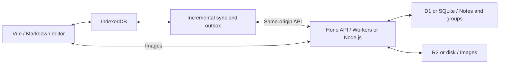

# snotes

A lightweight personal Markdown notebook with offline editing, device sync, and self-hosting on Cloudflare or your own server.

[](https://github.com/xilele777/snotes/releases/latest)
[](LICENSE)
[](https://workers.cloudflare.com/)

[中文](README.md) | English

Current stable release: **[v0.15.3](https://github.com/xilele777/snotes/releases/tag/v0.15.3)** ([all releases](https://github.com/xilele777/snotes/releases)). Standalone server support starts with `v0.7.0`.

[Interface and controls](#interface-and-controls) · [Cloudflare](#deploy-to-your-own-cloudflare-account) · [Server deployment](#can-i-host-this-on-my-own-server) · [Local development](#local-development) · [Changelog](CHANGELOG.md)

Notes are saved to the browser's IndexedDB before syncing in the background. Choose Cloudflare Workers with D1/R2, or Node.js with SQLite and local image storage. Both runtimes share the same API and sync logic. Use it to write and organize notes across your own computers and phones.

## Choose a deployment and version

| Option | Requirements | Persistent storage | Guide |
| --- | --- | --- | --- |
| Cloudflare | Cloudflare account, D1, R2; Node.js 22.12+ on the deployment machine | D1 database and R2 images | [Setup](#deploy-to-your-own-cloudflare-account) |
| Direct Node.js | Node.js 24 LTS and persistent disk | SQLite and local images | [Quick start](#can-i-host-this-on-my-own-server) |
| Docker Compose | Docker Engine and Compose plugin | `snotes-data` named volume | [Detailed guide (Chinese)](docs/server-deployment.md#docker-compose) |

Unpinned clone commands below follow `main`. To install a pinned version, run `git switch --detach v0.15.3` after cloning and before installing or building. `main` may contain subsequent unreleased changes; use a release tag to pin a version.

For an existing deployment, sync clients, back up data and save local configuration first. Run `git fetch origin --tags` and `git switch --detach v0.15.3`, then install, build and restart using the instructions for your deployment. A pinned tag uses detached HEAD: future upgrades require fetching and switching to the next tag instead of `git pull`. See the [Cloudflare update steps](#8-updating-to-a-new-version) for preserving configuration. Do not force a checkout over local changes.

The in-app update check only queries the latest **stable** GitHub release, caching successful results for 24 hours. It does not notify about previews or update your server automatically. Select previews manually from [Releases](https://github.com/xilele777/snotes/releases). Direct Node.js operation has been tested for this preview. Docker Compose configuration was validated, but image builds and container execution have not been tested.

## Features

- **Offline editing**: read and edit notes already synced to the device, then sync when reconnected.
- **Markdown editor**: headings, numbered lists, task lists, tables, images, and undo/redo, with Markdown stored as the source.
- **Organization**: groups, stars, pins, color markers, and search across titles and bodies.
- **Portable data**: export every note as a Markdown zip (images and properties included) and import `.md` files or a backup zip back in; single notes can be copied, downloaded or shared to other apps.
- **Dark mode and personalization**: follow the system theme or pick light or dark, adjust body font size and editor width; settings are saved per device.
- **Trash**: preview and restore deleted notes, each showing how many days remain before automatic deletion (30 by default); permanent deletion and emptying the trash require confirmation.
- **Writing statistics**: word counts, writing streaks, an activity heatmap, group distribution, and opens across devices.
- **Device sync**: properties and bodies sync separately; concurrent edits produce conflict copies for review and merging.
- **Body history**: older versions are kept automatically when edits are 5 minutes apart or large, both in the browser and on the server (20 entries, 30 days each); "History" in the editor top bar merges both and restores with one click.
- **Images and PWA**: paste images to upload to your server, view cached images offline, and install the app on desktop or mobile.
- **Lightweight UI**: system fonts, shared SVG icons, and lazy loading for the editor and statistics.

## Interface and controls

Desktop uses three columns for navigation, the note list, and the editor. Trash sits below Starred Notes and keeps the same list and preview dimensions. Statistics opens in a large dialog, preserving the editor position and undo history underneath.

| Entry | Behavior |
| --- | --- |
| All Notes / Starred / Groups | Filter notes, then select a row to read or edit |
| Trash | Preview, restore, or permanently delete notes; the detail header shows days left before deletion; returning restores the previous filter and reading position |
| Statistics icon | Open statistics; close with its button, Escape, the backdrop, or system Back |
| "Settings" at the bottom of the icon rail | A tabbed dialog: **Appearance** (theme, font size, editor width, per device), **Data** (export all, import a backup), **Shortcuts** (including a Markdown cheat sheet), **About** (version, upgrade steps, sign out). Shortcut `Ctrl / Cmd + ,` |
| Editor top bar | On desktop the word count, document info and history sit directly in the bar; "⋯" holds copy Markdown, download .md, share to other apps (browsers with system share), print / save as PDF. On phones word count, info, history and "Delete" all live in "⋯" |
| Editor footer | Desktop shows only the save state and word count; hidden on phones. Action feedback appears as a short message at the top of the screen |

Mobile opens to the list and switches to the editor when a note is selected. The top-left button opens navigation; the back button or system Back returns to the list. Desktop also supports focus mode.

| Shortcut | Action |
| --- | --- |
| `Alt / Option + N` | Create a note (`Ctrl + N` opens a browser window and cannot be intercepted) |
| `Ctrl / Cmd + ,` | Open settings |
| `Ctrl / Cmd + K` or `Ctrl / Cmd + F` | Focus note search |
| `Ctrl / Cmd + Z` | Undo in the editor |
| `Esc` | Close the current dialog or sidebar, exit focus mode, or clear search |

## Stack

| Layer | Technology |
| --- | --- |
| Frontend | Vue 3, Pinia, Milkdown (Markdown editor), Dexie (IndexedDB) |
| PWA | vite-plugin-pwa (Workbox) |
| Backend | Hono on Cloudflare Workers or Node.js 24 |
| Storage | Cloudflare D1/R2 or SQLite/local disk |
| Testing | Vitest (unit/integration), Playwright (end-to-end) |

## Architecture



- Data APIs use `Authorization: Bearer <token>`. Images also accept a same-origin cookie scoped to `Path=/api/images/`; `/api/health` needs no token.
- The sync engine lives in `src/sync/`: `pull` fetches the version manifest and missing bodies, `push` drains the outbox queue, `conflict` handles concurrent-edit copies
- Database schema is in `migrations/`; types shared between frontend and Worker are in `shared/types.ts`

## Deploy to your own Cloudflare account

You need one Worker, one D1 database, and one R2 bucket. Each product offers a free allowance; actual costs depend on usage. See [Free tier](#free-tier).

### 0. Prerequisites

- **Node.js 22.12 or newer** (wrangler 4 requires `>=22.0.0`, vite 8 requires `>=22.12.0`)
- **A Cloudflare account with R2 enabled**: go to Dashboard → R2 and follow the prompts. Step 2 fails if R2 hasn't been enabled.
- Log in to wrangler:

  ```bash
  npx wrangler login
  ```

### 1. Clone and install

```bash
git clone https://github.com/xilele777/snotes.git
cd snotes
npm ci
```

### 2. Create the D1 database and R2 bucket

```bash
npx wrangler d1 create snotes
npx wrangler r2 bucket create snotes-images
```

The first command prints a config snippet containing **your own** `database_id`, which you need in the next step:

```
[[d1_databases]]
binding = "DB"
database_name = "snotes"
database_id = "your-database-uuid"
```

> Want different names? See [Renaming and custom domains](#renaming-and-custom-domains). Keeping the defaults is the easiest path.

### 3. Put your database_id into wrangler.jsonc (required)

The repository ships with the original author's database ID. **Deployment will fail unless you replace it** — in **two places**:

```diff
   "d1_databases": [
     {
       "binding": "DB",
       "database_name": "snotes",
-      "database_id": "66325ab4-c335-4976-9a62-b0c9e5e21e97",
+      "database_id": "your uuid from step 2",
       "migrations_dir": "migrations"
     }
   ],
   ...
   "vars": {
-    "D1_DATABASE_ID": "66325ab4-c335-4976-9a62-b0c9e5e21e97",
+    "D1_DATABASE_ID": "the same uuid",
     "R2_BUCKET_NAME": "snotes-images"
   }
```

Same value, different purposes: `d1_databases[].database_id` is the runtime database binding — the app won't start without it. `vars.D1_DATABASE_ID` is only used by the usage-monitoring page to query Analytics; getting it wrong won't break note-taking, but the monitoring page won't show D1 data. Neither these IDs nor the bucket name are secrets, so committing them is fine.

### 4. Set the access token

This is the only credential protecting your notes. Use a random string, not a memorable password:

```bash
# Generate a 32-byte random token
node -e "console.log(Buffer.from(crypto.getRandomValues(new Uint8Array(32))).toString('base64url'))"

# Store it as a Worker secret (the command prompts you to paste it)
npx wrangler secret put ACCESS_TOKEN
```

`ACCESS_TOKEN` must be a secret — **never put it in the `vars` block of `wrangler.jsonc`**, which is plaintext config committed to the repo. Without it, data APIs return 401; the health check remains available.

### 5. Apply database migrations

```bash
npx wrangler d1 migrations apply snotes --remote
```

`--remote` targets the production database; `--local` only affects your local development database. The two are entirely separate.

### 6. Build and deploy

```bash
npm run deploy
```

This runs typecheck → vite build → wrangler deploy. On success you get a URL like `https://snotes.<your-subdomain>.workers.dev`.

Run an unauthenticated smoke check first:

```bash
curl https://snotes.<your-subdomain>.workers.dev/api/health
# expected: {"ok":true}
```

`/api/health` returns service status without exposing notes or tokens, for post-deploy verification.

### 7. First run

Open the Worker URL and paste the token from step 4. The token is stored locally in the browser, so you enter it once per device.

On mobile, use "Add to Home Screen" in Safari or Chrome to run it as a standalone PWA. On desktop Chrome or Edge, use the install button at the right of the address bar.

### 8. Updating to a new version

Manually deployed Workers do **not** update themselves when a release is published; pull the code and redeploy. At app startup, the app checks the latest stable GitHub Release and caches successful results for 24 hours. A blue dot on the version label and on the "Settings" rail button indicates a newer release; the About tab in Settings links to release notes and shows upgrade steps. For release notifications, choose **Watch → Custom → Releases** on GitHub and enable email in your notification settings. The `git pull` instructions below apply to a tracked branch; pinned deployments should use the [tag upgrade steps](#choose-a-deployment-and-version) above.

Read the [CHANGELOG](CHANGELOG.md), back up your data following the [operations guide](docs/operations.md), enter the project directory and check `git status`. **If `wrangler.jsonc` has uncommitted deployment settings**, back it up outside the repository, then stash those changes:

```bash
git stash push -m "snotes deployment config" -- wrangler.jsonc
```

Only run this when there are config changes and confirm that Git created a stash. Save any other code changes too. If you previously enabled `skip-worktree`, run `git update-index --no-skip-worktree wrangler.jsonc` before checking status. That flag does not prevent upstream merge conflicts.

```bash
git pull --ff-only                                  # update the current branch
```

If you created the config stash above, run `git stash apply 'stash@{0}'` next (do not create another stash in between). Resolve any conflicts, preserving your Worker name, both database IDs and bucket names while incorporating upstream fields. Check the config before continuing. The stash remains as a backup until you choose to remove it after verification. Fork users must also sync the original project's changes into their branch; `git pull` only updates the current tracking branch.

```bash
npm ci                                              # install the locked dependencies
npx wrangler d1 migrations apply snotes --remote    # only does work when there are new migrations
npm run deploy                                      # build and deploy
```

Replace `snotes` in the migration command if you renamed the database. Secrets such as `ACCESS_TOKEN` stay on Cloudflare and do not need to be re-entered. After deployment, stay online while the browser downloads the new Service Worker and cache, then reload or close all app windows and reopen. Check the version dialog to verify the new build; offline clients or clients still using the old cache do not update immediately.

### Optional: configure the usage-monitoring API

The `/api/metrics` endpoint and monitoring component are retained, but the sidebar entry is currently hidden. This setup is optional and does not affect notes or writing statistics. An unconfigured metrics endpoint returns 503 with `not_configured`.

Two secrets are needed:

```bash
npx wrangler secret put CF_ACCOUNT_ID   # Cloudflare account ID, in the Dashboard sidebar
npx wrangler secret put CF_API_TOKEN    # needs Account > Analytics > Read
```

For an existing Worker, `wrangler secret put` creates and immediately deploys a version containing the updated secret. Run `npm run deploy` as well if code changed. See the [Wrangler secret commands](https://developers.cloudflare.com/workers/wrangler/commands/workers/#secret).

To create the API token: Dashboard → My Profile → API Tokens → Create Token → Custom token, granting only **Account · Account Analytics · Read**. Don't grant anything broader.

### Renaming and custom domains

To use different names, edit the corresponding fields in `wrangler.jsonc` and keep them consistent with the resources you actually created:

| Field | Purpose | Matching command |
| --- | --- | --- |
| `name` | Worker name, determines `<name>.<subdomain>.workers.dev` | none needed |
| `d1_databases[].database_name` | D1 database name | `wrangler d1 create <name>` |
| `r2_buckets[].bucket_name` | R2 bucket name | `wrangler r2 bucket create <name>` |
| `vars.R2_BUCKET_NAME` | used by the monitoring page, must match the row above | — |

If you rename the database, update the migration command too: `wrangler d1 migrations apply <new-name> --remote`.

For a custom domain: Cloudflare Dashboard → Workers & Pages → select the Worker → Settings → Domains & Routes → Add Custom Domain. The domain must be on the same Cloudflare account.

### Deployment troubleshooting

| Symptom | Cause and fix |
| --- | --- |
| Deploy fails with `Couldn't find DB` or a D1 not-found error | The `database_id` from step 3 wasn't replaced, or only one of the two places was updated |
| `wrangler r2 bucket create` fails | R2 isn't enabled on the account — enable it under Dashboard → R2 |
| Migration can't find the database | Step 2 was skipped, or the database name in the command doesn't match `wrangler.jsonc` |
| The page keeps asking for the token | Check that the browser token matches the Worker's `ACCESS_TOKEN`; use `wrangler secret put ACCESS_TOKEN` to rotate it if needed |
| `/api/health` works but notes fail to load with 401 | Same cause; clear the token in the browser and re-enter it |
| Deploy succeeds but there's no workers.dev URL | The account's workers.dev subdomain is disabled — enable it under Workers & Pages → Settings, or attach a custom domain |
| Images broken, everything else fine | Bucket name doesn't match `wrangler.jsonc`, or the `snotes_token` cookie is missing — see the [operations guide](docs/operations.md) |
| Monitoring page shows "not configured" | `CF_ACCOUNT_ID` / `CF_API_TOKEN` aren't set, or the token lacks Account Analytics Read |
| `stdin is not a tty` on Windows Git Bash | Run interactive commands like `wrangler secret put` from PowerShell or CMD, or prefix them with `winpty` |

## Can I host this on my own server?

Yes. Use **Docker Compose** or **Node.js 24 LTS** directly. The server serves both the frontend and API, stores notes in SQLite and saves images to disk. No Cloudflare account is required.

Direct Node.js:

```bash
git clone --branch v0.15.3 https://github.com/xilele777/snotes.git
cd snotes
npm ci
npm run build:server
cp server.env.example .env.server
# Set a random ACCESS_TOKEN in .env.server before starting
npm start
```

The default address is `http://127.0.0.1:3000`. Startup automatically applies pending migrations. `SNOTES_DATA_DIR` defaults to `./data`; preserve this entire directory, including images and SQLite WAL files, across upgrades. Configure an HTTPS reverse proxy for remote use. The provided [systemd service](deploy/snotes.service) uses `/var/lib/snotes` for data; the [Caddy example](deploy/Caddyfile.example) provides HTTPS.

Alternatively, install with Docker Compose:

```bash
git clone --branch v0.15.3 https://github.com/xilele777/snotes.git
cd snotes
cp server.env.example .env
# Set a random ACCESS_TOKEN in .env before starting
docker compose up -d --build
```

Generate a token with at least 32 random bytes using a password manager or `node -e "console.log(crypto.randomBytes(32).toString('base64url'))"`. Node.js reads `.env.server`; Compose reads `.env`. Both files are gitignored. Docker binds to localhost port 3000 and keeps data in the `snotes-data` named volume. Never use `docker compose down -v` unless you intend to delete your notes. Back up the entire data directory while the service is stopped. After switching to the new release tag, Node upgrades use `npm ci`, `npm run build:server`, then a service restart; Docker upgrades rebuild the container while retaining the volume.

Cloudflare data is not migrated automatically. Source code may live on any Git host; release notifications query the original GitHub repository but are optional for normal operation. Cloudflare usage monitoring is unavailable on the server runtime; writing statistics remain available. See the [detailed server deployment guide (Chinese)](docs/server-deployment.md) for setup, backup and recovery.

## Local development

```bash
npm ci

# Create a local token configuration on first setup
echo "ACCESS_TOKEN=dev-token" > .dev.vars

# Initialise the local database (separate from production)
npx wrangler d1 migrations apply snotes --local

npm run dev:worker   # terminal 1: Worker on 8787
npm run dev          # terminal 2: frontend on 5173
```

Open <http://localhost:5173> and enter `dev-token`. The frontend reaches the API on 8787 through the vite proxy, matching the same-origin shape of production. `.dev.vars` is gitignored.

Local development doesn't need real D1/R2 resources — wrangler simulates them locally, so you can do this before touching `database_id`.

### Testing

```bash
npm test            # frontend and shared pure logic
npm run test:worker # Worker integration tests (in the real Workers runtime)
npm run test:server # SQLite / disk / API server integration tests
npm run test:all    # all unit and integration tests
npm run test:e2e    # Playwright end-to-end
npm run test:e2e:server # same browser suite against Node.js
npm run typecheck   # type checking
```

The E2E suite builds the app, applies migrations, and starts `wrangler dev` on port `8790`, testing the production shape (same-origin static assets + API). It uses the fixture token in `tests/e2e/wrangler.jsonc` and stores its isolated test data in `tmp/e2e-state`. No need to start anything first.

Server tests require Node.js 24. `test:e2e:server` starts a real Node.js server on port `8791`, with data in `tmp/e2e-server-state`. Run the two E2E suites sequentially because both build into `dist/`.

Please make sure `npm run test:all && npm run build` passes before committing.

## Free tier

Costs depend on requests, database reads and writes, image storage, and operations. The app is not guaranteed to be free for every workload. Check the current allowances and billing rules in the official documentation:

- [Workers pricing](https://developers.cloudflare.com/workers/platform/pricing/)
- [D1 pricing](https://developers.cloudflare.com/d1/platform/pricing/)
- [R2 pricing](https://developers.cloudflare.com/r2/pricing/)

Optional usage-monitoring calculations live in `worker/metrics/collect.ts` and need updating if platform policies change.

## Backup and migration

**In-app export / import**: the "Data" tab in Settings (icon rail) downloads every note as a zip with one folder per group, one `.md` per note, images under `images/` with relative paths, and an `index.json` recording groups, stars, pins, colors and creation times. The same zip can be imported into any deployment (Cloudflare or standalone server); images are re-uploaded and importing the same package twice does not create duplicates. This is the recommended way to migrate or back up without the command line.

**Standalone server / Docker**: sync clients, stop the service and back up the entire data directory or volume, including SQLite, any WAL/SHM files and images. See [backup, upgrade and recovery (Chinese)](docs/server-deployment.md#备份升级与恢复). Data is not migrated automatically between Cloudflare and standalone deployments.

**Cloudflare**: D1 backup and restore commands (Bash):

```bash
# Export regularly and before upgrades
npx wrangler d1 export snotes --remote --output "backup-$(date +%Y%m).sql"

# Restore
npx wrangler d1 execute snotes --remote --file backup-YYYYMM.sql
```

The SQL export contains notes, groups, and metadata already synced to D1. Images live in R2 and must be copied separately for a complete backup. Unsynced browser data is not part of a server backup.

## Project structure

```
src/            frontend (Vue 3 + Pinia)
  components/    list, detail, sidebar, monitoring components
  editor/        Milkdown editor wrapper
  stores/        Pinia state (notes / ui / groups)
  sync/          sync engine (pull / push / conflict)
  db/            Dexie schema and repos
  api/           client for talking to the Worker
  navigation.ts  History navigation for views, statistics, and reading positions
worker/         shared Hono API and Cloudflare entry
  routes/        notes / opens / groups / sync / trash / images / metrics
  metrics/       D1/R2/HTTP metrics collection
  auth.ts        Bearer + cookie auth middleware
shared/         types and logic shared by both sides (sync reduce, sorting, sanitising)
server/         Node.js entry, SQLite and disk image adapters
deploy/         systemd and HTTPS reverse proxy examples
migrations/     D1 / SQLite database migrations
tests/          e2e, Worker integration, unit tests and setup
docs/           design documents, operations guide
```

## Documentation

- [Design document](docs/superpowers/specs/2026-08-22-snotes-design.md) (Chinese)
- [Implementation plan](docs/superpowers/plans/2026-08-22-snotes.md) (Chinese)
- [Operations guide](docs/operations.md) (Chinese) — token mechanics, sync failure triage, backups, FAQ
- [Server deployment](docs/server-deployment.md) (Chinese) — Node.js, Docker, systemd, HTTPS, backups and upgrades
- [UI design and verification](docs/ui-refresh.md) (Chinese)
- [Feature backlog](docs/roadmap.md) (Chinese) — planned features and operational improvements in three tiers
- [Changelog](CHANGELOG.md)

## Security

This is a **single-user, self-hosted** application. Authentication is one shared token — use it with that in mind:

- Anyone holding the `ACCESS_TOKEN` can read and write all your notes and images. There are no multiple users, sharing, or permission levels
- The token is kept in the browser's `localStorage`, plus a cookie scoped to `Path=/api/images/` that exists solely for `` requests
- To rotate the token, use `wrangler secret put ACCESS_TOKEN` on Cloudflare. For Node.js, edit `.env.server` or your service environment file and restart the process. For Docker, edit `.env` and run `docker compose up -d --force-recreate snotes`. Clients using the old token get a 401 and return to the token entry screen; local data is unaffected
- Never put tokens in `wrangler.jsonc` or any committed file. Keep server tokens in ignored environment files or server-side secret files

Please report security issues privately via GitHub [Security Advisories](https://github.com/xilele777/snotes/security/advisories/new) rather than opening a public issue.

## Contributing

Issues and pull requests are welcome. Before submitting:

- Make sure `npm run test:all && npm run build` passes
- Follow [Conventional Commits](https://www.conventionalcommits.org/) — see [CLAUDE.md](CLAUDE.md) for the exact format
- Schema changes always go into a new incrementing `migrations/000N_*.sql`; never edit an existing migration. Migration numbers are a separate sequence from the app version
- The single source of truth for the version is the `version` field in the root `package.json`; the release process is in [CLAUDE.md](CLAUDE.md)
- Behaviour changes should come with tests

## License

[MIT](LICENSE) © xilele777
