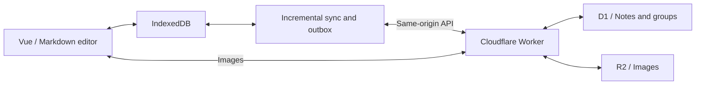

# snotes

A lightweight personal Markdown notebook with offline editing, device sync, and Cloudflare self-hosting.

[](https://github.com/xilele777/snotes/releases/latest)
[](LICENSE)
[](https://workers.cloudflare.com/)

[中文](README.md) | English

[Interface and controls](#interface-and-controls) · [Self-hosting](#deploy-to-your-own-cloudflare-account) · [Local development](#local-development) · [Changelog](CHANGELOG.md)

Notes are saved to the browser's IndexedDB before syncing in the background. One Cloudflare Worker serves the web app and API, D1 stores notes and groups, and R2 stores images. Use it to write and organize notes across your own computers and phones.

## Features

- **Offline editing**: read and edit notes already synced to the device, then sync when reconnected.
- **Markdown editor**: headings, numbered lists, task lists, tables, images, and undo/redo, with Markdown stored as the source.
- **Organization**: groups, stars, pins, color markers, and search across titles and bodies.
- **Trash**: preview and restore deleted notes; permanent deletion and emptying the trash require confirmation.
- **Writing statistics**: word counts, writing streaks, an activity heatmap, group distribution, and opens across devices.
- **Device sync**: properties and bodies sync separately; concurrent edits produce conflict copies for review and merging.
- **Images and PWA**: paste images to upload to R2, view cached images offline, and install the app on desktop or mobile.
- **Lightweight UI**: system fonts, shared SVG icons, and lazy loading for the editor and statistics.

## Interface and controls

Desktop uses three columns for navigation, the note list, and the editor. Trash sits below Starred Notes and keeps the same list and preview dimensions. Statistics opens in a large dialog, preserving the editor position and undo history underneath.

| Entry | Behavior |
| --- | --- |
| All Notes / Starred / Groups | Filter notes, then select a row to read or edit |
| Trash | Preview, restore, or permanently delete notes; returning restores the previous filter and reading position |
| Statistics icon | Open statistics; close with its button, Escape, the backdrop, or system Back |
| Editor footer | View word counts, document information, and Markdown formatting hints |

Mobile opens to the list and switches to the editor when a note is selected. The top-left button opens navigation; the back button or system Back returns to the list. Desktop also supports focus mode.

| Shortcut | Action |
| --- | --- |
| `Ctrl / Cmd + N` | Create a note |
| `Ctrl / Cmd + K` or `Ctrl / Cmd + F` | Focus note search |
| `Ctrl / Cmd + Z` | Undo in the editor |
| `Esc` | Close the current dialog or sidebar, exit focus mode, or clear search |

## Stack

| Layer | Technology |
| --- | --- |
| Frontend | Vue 3, Pinia, Milkdown (Markdown editor), Dexie (IndexedDB) |
| PWA | vite-plugin-pwa (Workbox) |
| Backend | Cloudflare Workers, Hono |
| Storage | Cloudflare D1 (metadata/body), R2 (images) |
| Testing | Vitest (unit/integration), Playwright (end-to-end) |

## Architecture



- Data APIs use `Authorization: Bearer <token>`. Images also accept a same-origin cookie scoped to `Path=/api/images/`; `/api/health` needs no token.
- The sync engine lives in `src/sync/`: `pull` fetches the version manifest and missing bodies, `push` drains the outbox queue, `conflict` handles concurrent-edit copies
- Database schema is in `migrations/`; types shared between frontend and Worker are in `shared/types.ts`

## Deploy to your own Cloudflare account

You need one Worker, one D1 database, and one R2 bucket. Each product offers a free allowance; actual costs depend on usage. See [Free tier](#free-tier).

### 0. Prerequisites

- **Node.js 22.12 or newer** (wrangler 4 requires `>=22.0.0`, vite 8 requires `>=22.12.0`)
- **A Cloudflare account with R2 enabled**: go to Dashboard → R2 and follow the prompts. Step 2 fails if R2 hasn't been enabled.
- Log in to wrangler:

  ```bash
  npx wrangler login
  ```

### 1. Clone and install

```bash
git clone https://github.com/xilele777/snotes.git
cd snotes
npm ci
```

### 2. Create the D1 database and R2 bucket

```bash
npx wrangler d1 create snotes
npx wrangler r2 bucket create snotes-images
```

The first command prints a config snippet containing **your own** `database_id`, which you need in the next step:

```
[[d1_databases]]
binding = "DB"
database_name = "snotes"
database_id = "your-database-uuid"
```

> Want different names? See [Renaming and custom domains](#renaming-and-custom-domains). Keeping the defaults is the easiest path.

### 3. Put your database_id into wrangler.jsonc (required)

The repository ships with the original author's database ID. **Deployment will fail unless you replace it** — in **two places**:

```diff
   "d1_databases": [
     {
       "binding": "DB",
       "database_name": "snotes",
-      "database_id": "66325ab4-c335-4976-9a62-b0c9e5e21e97",
+      "database_id": "your uuid from step 2",
       "migrations_dir": "migrations"
     }
   ],
   ...
   "vars": {
-    "D1_DATABASE_ID": "66325ab4-c335-4976-9a62-b0c9e5e21e97",
+    "D1_DATABASE_ID": "the same uuid",
     "R2_BUCKET_NAME": "snotes-images"
   }
```

Same value, different purposes: `d1_databases[].database_id` is the runtime database binding — the app won't start without it. `vars.D1_DATABASE_ID` is only used by the usage-monitoring page to query Analytics; getting it wrong won't break note-taking, but the monitoring page won't show D1 data. Neither these IDs nor the bucket name are secrets, so committing them is fine.

### 4. Set the access token

This is the only credential protecting your notes. Use a random string, not a memorable password:

```bash
# Generate a 32-byte random token
node -e "console.log(Buffer.from(crypto.getRandomValues(new Uint8Array(32))).toString('base64url'))"

# Store it as a Worker secret (the command prompts you to paste it)
npx wrangler secret put ACCESS_TOKEN
```

`ACCESS_TOKEN` must be a secret — **never put it in the `vars` block of `wrangler.jsonc`**, which is plaintext config committed to the repo. Without it, data APIs return 401; the health check remains available.

### 5. Apply database migrations

```bash
npx wrangler d1 migrations apply snotes --remote
```

`--remote` targets the production database; `--local` only affects your local development database. The two are entirely separate.

### 6. Build and deploy

```bash
npm run deploy
```

This runs typecheck → vite build → wrangler deploy. On success you get a URL like `https://snotes.<your-subdomain>.workers.dev`.

Run an unauthenticated smoke check first:

```bash
curl https://snotes.<your-subdomain>.workers.dev/api/health
# expected: {"ok":true}
```

`/api/health` returns service status without exposing notes or tokens, for post-deploy verification.

### 7. First run

Open the Worker URL and paste the token from step 4. The token is stored locally in the browser, so you enter it once per device.

On mobile, use "Add to Home Screen" in Safari or Chrome to run it as a standalone PWA. On desktop Chrome or Edge, use the install button at the right of the address bar.

### 8. Updating to a new version

Manually deployed Workers do **not** update themselves when a release is published; pull the code and redeploy. At app startup, the bottom-left version button checks the latest GitHub Release and caches successful results for 24 hours. A blue dot indicates a newer release; the dialog links to release notes and shows upgrade steps. For release notifications, choose **Watch → Custom → Releases** on GitHub and enable email in your notification settings.

Read the [CHANGELOG](CHANGELOG.md), back up your data following the [operations guide](docs/operations.md), enter the project directory and check `git status`. **If `wrangler.jsonc` has uncommitted deployment settings**, back it up outside the repository, then stash those changes:

```bash
git stash push -m "snotes deployment config" -- wrangler.jsonc
```

Only run this when there are config changes and confirm that Git created a stash. Save any other code changes too. If you previously enabled `skip-worktree`, run `git update-index --no-skip-worktree wrangler.jsonc` before checking status. That flag does not prevent upstream merge conflicts.

```bash
git pull --ff-only                                  # update the current branch
```

If you created the config stash above, run `git stash apply 'stash@{0}'` next (do not create another stash in between). Resolve any conflicts, preserving your Worker name, both database IDs and bucket names while incorporating upstream fields. Check the config before continuing. The stash remains as a backup until you choose to remove it after verification. Fork users must also sync the original project's changes into their branch; `git pull` only updates the current tracking branch.

```bash
npm ci                                              # install the locked dependencies
npx wrangler d1 migrations apply snotes --remote    # only does work when there are new migrations
npm run deploy                                      # build and deploy
```

Replace `snotes` in the migration command if you renamed the database. Secrets such as `ACCESS_TOKEN` stay on Cloudflare and do not need to be re-entered. After deployment, stay online while the browser downloads the new Service Worker and cache, then reload or close all app windows and reopen. Check the version dialog to verify the new build; offline clients or clients still using the old cache do not update immediately.

### Optional: configure the usage-monitoring API

The `/api/metrics` endpoint and monitoring component are retained, but the sidebar entry is currently hidden. This setup is optional and does not affect notes or writing statistics. An unconfigured metrics endpoint returns 503 with `not_configured`.

Two secrets are needed:

```bash
npx wrangler secret put CF_ACCOUNT_ID   # Cloudflare account ID, in the Dashboard sidebar
npx wrangler secret put CF_API_TOKEN    # needs Account > Analytics > Read
```

For an existing Worker, `wrangler secret put` creates and immediately deploys a version containing the updated secret. Run `npm run deploy` as well if code changed. See the [Wrangler secret commands](https://developers.cloudflare.com/workers/wrangler/commands/workers/#secret).

To create the API token: Dashboard → My Profile → API Tokens → Create Token → Custom token, granting only **Account · Account Analytics · Read**. Don't grant anything broader.

### Renaming and custom domains

To use different names, edit the corresponding fields in `wrangler.jsonc` and keep them consistent with the resources you actually created:

| Field | Purpose | Matching command |
| --- | --- | --- |
| `name` | Worker name, determines `<name>.<subdomain>.workers.dev` | none needed |
| `d1_databases[].database_name` | D1 database name | `wrangler d1 create <name>` |
| `r2_buckets[].bucket_name` | R2 bucket name | `wrangler r2 bucket create <name>` |
| `vars.R2_BUCKET_NAME` | used by the monitoring page, must match the row above | — |

If you rename the database, update the migration command too: `wrangler d1 migrations apply <new-name> --remote`.

For a custom domain: Cloudflare Dashboard → Workers & Pages → select the Worker → Settings → Domains & Routes → Add Custom Domain. The domain must be on the same Cloudflare account.

### Deployment troubleshooting

| Symptom | Cause and fix |
| --- | --- |
| Deploy fails with `Couldn't find DB` or a D1 not-found error | The `database_id` from step 3 wasn't replaced, or only one of the two places was updated |
| `wrangler r2 bucket create` fails | R2 isn't enabled on the account — enable it under Dashboard → R2 |
| Migration can't find the database | Step 2 was skipped, or the database name in the command doesn't match `wrangler.jsonc` |
| The page keeps asking for the token | Check that the browser token matches the Worker's `ACCESS_TOKEN`; use `wrangler secret put ACCESS_TOKEN` to rotate it if needed |
| `/api/health` works but notes fail to load with 401 | Same cause; clear the token in the browser and re-enter it |
| Deploy succeeds but there's no workers.dev URL | The account's workers.dev subdomain is disabled — enable it under Workers & Pages → Settings, or attach a custom domain |
| Images broken, everything else fine | Bucket name doesn't match `wrangler.jsonc`, or the `snotes_token` cookie is missing — see the [operations guide](docs/operations.md) |
| Monitoring page shows "not configured" | `CF_ACCOUNT_ID` / `CF_API_TOKEN` aren't set, or the token lacks Account Analytics Read |
| `stdin is not a tty` on Windows Git Bash | Run interactive commands like `wrangler secret put` from PowerShell or CMD, or prefix them with `winpty` |

## Can I host this on my own server?

Not in its current form. The backend talks to D1 and R2 through Workers bindings and the static files are served by Workers Assets; there is no adapter layer for other databases or object stores, so the app cannot be dropped onto a VPS, Docker host or another cloud as-is.

The source does not have to be hosted on GitHub. Keep it on GitLab, Gitee or locally and deploy to Cloudflare using `wrangler` from a computer or CI. Runtime dependencies are Cloudflare Workers, D1 and R2. In-app release notifications still query the original project's GitHub Releases; a failed check does not affect notes.

Hosting outside Cloudflare would mean replacing the D1 SQL in `worker/` with SQLite/Postgres, swapping R2 for local disk or S3-compatible storage, and serving the static files from a Node server. That is a separate porting effort; open an issue if you want to discuss it.

## Local development

```bash
npm ci

# Create a local token configuration on first setup
echo "ACCESS_TOKEN=dev-token" > .dev.vars

# Initialise the local database (separate from production)
npx wrangler d1 migrations apply snotes --local

npm run dev:worker   # terminal 1: Worker on 8787
npm run dev          # terminal 2: frontend on 5173
```

Open <http://localhost:5173> and enter `dev-token`. The frontend reaches the API on 8787 through the vite proxy, matching the same-origin shape of production. `.dev.vars` is gitignored.

Local development doesn't need real D1/R2 resources — wrangler simulates them locally, so you can do this before touching `database_id`.

### Testing

```bash
npm test            # frontend and shared pure logic
npm run test:worker # Worker integration tests (in the real Workers runtime)
npm run test:all    # both of the above
npm run test:e2e    # Playwright end-to-end
npm run typecheck   # type checking
```

The E2E suite builds the app, applies migrations, and starts `wrangler dev` on port `8790`, testing the production shape (same-origin static assets + API). It uses the fixture token in `tests/e2e/wrangler.jsonc` and stores its isolated test data in `tmp/e2e-state`. No need to start anything first.

Please make sure `npm run test:all && npm run build` passes before committing.

## Free tier

Costs depend on requests, database reads and writes, image storage, and operations. The app is not guaranteed to be free for every workload. Check the current allowances and billing rules in the official documentation:

- [Workers pricing](https://developers.cloudflare.com/workers/platform/pricing/)
- [D1 pricing](https://developers.cloudflare.com/d1/platform/pricing/)
- [R2 pricing](https://developers.cloudflare.com/r2/pricing/)

Optional usage-monitoring calculations live in `worker/metrics/collect.ts` and need updating if platform policies change.

## Backup and migration

```bash
# Export (a manual run each month is enough)
npx wrangler d1 export snotes --remote --output "backup-$(date +%Y%m).sql"

# Restore
npx wrangler d1 execute snotes --remote --file backup-YYYYMM.sql
```

The SQL export contains notes, groups, and metadata already synced to D1. Images live in R2 and must be copied separately for a complete backup. Unsynced browser data is not part of a server backup.

## Project structure

```
src/            frontend (Vue 3 + Pinia)
  components/    list, detail, sidebar, monitoring components
  editor/        Milkdown editor wrapper
  stores/        Pinia state (notes / ui / groups)
  sync/          sync engine (pull / push / conflict)
  db/            Dexie schema and repos
  api/           client for talking to the Worker
  navigation.ts  History navigation for views, statistics, and reading positions
worker/         Cloudflare Worker (Hono API)
  routes/        notes / opens / groups / sync / trash / images / metrics
  metrics/       D1/R2/HTTP metrics collection
  auth.ts        Bearer + cookie auth middleware
shared/         types and logic shared by both sides (sync reduce, sorting, sanitising)
migrations/     D1 database migrations
tests/          e2e, Worker integration, unit tests and setup
docs/           design documents, operations guide
```

## Documentation

- [Design document](docs/superpowers/specs/2026-08-22-snotes-design.md) (Chinese)
- [Implementation plan](docs/superpowers/plans/2026-08-22-snotes.md) (Chinese)
- [Operations guide](docs/operations.md) (Chinese) — token mechanics, sync failure triage, backups, FAQ
- [UI design and verification](docs/ui-refresh.md) (Chinese)
- [Changelog](CHANGELOG.md)

## Security

This is a **single-user, self-hosted** application. Authentication is one shared token — use it with that in mind:

- Anyone holding the `ACCESS_TOKEN` can read and write all your notes and images. There are no multiple users, sharing, or permission levels
- The token is kept in the browser's `localStorage`, plus a cookie scoped to `Path=/api/images/` that exists solely for `` requests
- If the token leaks, update the live secret with `wrangler secret put ACCESS_TOKEN`. Clients using the old token get a 401 and return to the token entry screen; local data is unaffected
- Never commit the token to `wrangler.jsonc`, `.env`, or any file that reaches the repository

Please report security issues privately via GitHub [Security Advisories](https://github.com/xilele777/snotes/security/advisories/new) rather than opening a public issue.

## Contributing

Issues and pull requests are welcome. Before submitting:

- Make sure `npm run test:all && npm run build` passes
- Follow [Conventional Commits](https://www.conventionalcommits.org/) — see [CLAUDE.md](CLAUDE.md) for the exact format
- Schema changes always go into a new incrementing `migrations/000N_*.sql`; never edit an existing migration. Migration numbers are a separate sequence from the app version
- The single source of truth for the version is the `version` field in the root `package.json`; the release process is in [CLAUDE.md](CLAUDE.md)
- Behaviour changes should come with tests

## License

[MIT](LICENSE) © xilele777
