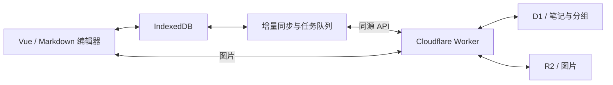

# snotes

轻量的个人 Markdown 笔记，支持离线编辑、多设备同步和 Cloudflare 自托管。

[](https://github.com/xilele777/snotes/releases/latest)
[](LICENSE)
[](https://workers.cloudflare.com/)

中文 | [English](README.en.md)

[界面与操作](#界面与操作) · [自托管部署](#部署到你自己的-cloudflare-账号) · [本地开发](#本地开发) · [更新记录](CHANGELOG.md)

笔记先保存在浏览器的 IndexedDB，再由后台增量同步。一个 Cloudflare Worker 同时提供网页和 API，D1 保存笔记与分组，R2 保存图片。适合在自己的电脑和手机之间记录、整理与继续写作。

## 特点

- **离线优先**：已同步到本机的笔记可离线阅读和编辑，联网后自动同步。
- **Markdown 编辑**：支持标题、编号列表、任务清单、表格、图片和撤销重做，正文以 Markdown 保存。
- **日常整理**：分组、星标、置顶、颜色标记及标题/正文搜索。
- **回收站**：删除后可预览并恢复；彻底删除和清空需要确认。
- **写作统计**：查看字数、连续写作、更新热力图、分组分布和跨设备打开记录。
- **多设备同步**：属性与正文分开同步；并发编辑时保存冲突副本，供后续合并。
- **图片与 PWA**：粘贴图片上传到 R2，已缓存的图片可离线查看；支持安装到桌面或手机主屏。
- **轻量界面**：系统字体、共享 SVG 图标，编辑器与统计内容按需加载。

## 界面与操作

桌面采用固定的导航、笔记目录和正文三栏。回收站位于“星标笔记”下方，切换后沿用相同的列表和预览尺寸。统计在大弹窗中打开，关闭后保留原来的编辑位置与撤销记录。

| 入口 | 操作 |
| --- | --- |
| 全部笔记 / 星标 / 分组 | 筛选笔记，点击列表条目阅读或编辑 |
| 回收站 | 查看已删除笔记，恢复或彻底删除；返回笔记时恢复之前的筛选与阅读位置 |
| 左侧统计图标 | 打开统计弹窗，支持关闭按钮、Esc、点击遮罩和系统返回 |
| 正文底部 | 查看字数、文档信息和 Markdown 格式提示 |

手机默认展示目录，打开笔记后进入正文；左上角按钮展开导航，返回按钮或系统返回回到列表。桌面正文可切换专注模式。

| 快捷键 | 功能 |
| --- | --- |
| `Ctrl / Cmd + N` | 新建笔记 |
| `Ctrl / Cmd + K` 或 `Ctrl / Cmd + F` | 聚焦笔记搜索 |
| `Ctrl / Cmd + Z` | 在编辑器中撤销 |
| `Esc` | 关闭当前弹窗或侧栏、退出专注模式，或清除搜索 |

## 技术栈

| 层 | 技术 |
| --- | --- |
| 前端 | Vue 3、Pinia、Milkdown（Markdown 编辑器）、Dexie（IndexedDB） |
| PWA | vite-plugin-pwa（Workbox） |
| 后端 | Cloudflare Workers、Hono |
| 存储 | Cloudflare D1（元数据/正文）、R2（图片） |
| 测试 | Vitest（单元/集成）、Playwright（端到端） |

## 架构



- 数据 API 使用 `Authorization: Bearer <token>` 鉴权；图片请求支持同源 Cookie（`Path=/api/images/`），健康检查 `/api/health` 无需令牌。
- 同步引擎在 `src/sync/`：`pull` 拉版本清单与缺失正文，`push` 消费 outbox 队列，`conflict` 处理并发冲突副本
- 数据库 schema 在 `migrations/`，前后端共用类型在 `shared/types.ts`

## 部署到你自己的 Cloudflare 账号

需要一个 Worker、一个 D1 数据库和一个 R2 桶。各产品提供免费额度，实际费用取决于用量，参见[免费额度](#免费额度)。

### 0. 前置条件

- **Node.js 22.12 或更高版本**（wrangler 4 要求 `>=22.0.0`，vite 8 要求 `>=22.12.0`）
- **一个 Cloudflare 账号**，并且**已在控制台开通 R2**：进入 Dashboard → R2 按提示开通。未开通时第 2 步创建桶会失败。
- 登录 wrangler：

  ```bash
  npx wrangler login
  ```

### 1. 克隆并安装

```bash
git clone https://github.com/xilele777/snotes.git
cd snotes
npm ci
```

### 2. 创建 D1 数据库与 R2 桶

```bash
npx wrangler d1 create snotes
npx wrangler r2 bucket create snotes-images
```

第一条命令会打印一段配置片段，其中的 `database_id` 是**你自己账号的**，下一步要用：

```
[[d1_databases]]
binding = "DB"
database_name = "snotes"
database_id = "你的-数据库-uuid"
```

> 想换名字请看下面的[改名与自定义域名](#改名与自定义域名)。现在保持默认名最省事。

### 3. 把 database_id 填进 wrangler.jsonc（必做）

仓库里的 `wrangler.jsonc` 带着原作者账号的数据库 ID，**不改这一步部署必然失败**。需要替换的是**两处**：

```diff
   "d1_databases": [
     {
       "binding": "DB",
       "database_name": "snotes",
-      "database_id": "66325ab4-c335-4976-9a62-b0c9e5e21e97",
+      "database_id": "第 2 步返回的你自己的 uuid",
       "migrations_dir": "migrations"
     }
   ],
   ...
   "vars": {
-    "D1_DATABASE_ID": "66325ab4-c335-4976-9a62-b0c9e5e21e97",
+    "D1_DATABASE_ID": "同一个 uuid",
     "R2_BUCKET_NAME": "snotes-images"
   }
```

两处的值相同但用途不同：`d1_databases[].database_id` 是运行时数据库绑定，缺它应用起不来；`vars.D1_DATABASE_ID` 只给用量监控页查询 Analytics 用，填错不影响笔记功能，但监控页会读不到 D1 数据。这两个 ID 和桶名都不是机密，可以放心提交进仓库。

### 4. 设置访问令牌

这是保护你笔记的唯一凭据，请用随机串，不要用生日或常见密码：

```bash
# 生成一个 32 字节随机令牌
node -e "console.log(Buffer.from(crypto.getRandomValues(new Uint8Array(32))).toString('base64url'))"

# 把它写进 Worker 密钥（命令会提示粘贴）
npx wrangler secret put ACCESS_TOKEN
```

`ACCESS_TOKEN` 必须以密钥形式存在，**不要写进 `wrangler.jsonc` 的 `vars`**——那里的内容是明文配置，会随仓库一起公开。未设置时，除健康检查外的数据 API 返回 401。

### 5. 应用数据库迁移

```bash
npx wrangler d1 migrations apply snotes --remote
```

`--remote` 打的是线上库，`--local` 只影响本机开发库，两者互不相通。

### 6. 构建并部署

```bash
npm run deploy
```

该命令等价于「类型检查 → vite 构建 → wrangler 部署」。成功后终端会给出一个形如 `https://snotes.<你的子域>.workers.dev` 的地址。

先做一次免鉴权冒烟检查：

```bash
curl https://snotes.<你的子域>.workers.dev/api/health
# 期望输出：{"ok":true}
```

`/api/health` 返回服务状态，不包含笔记或令牌，用于部署后验活。

### 7. 首次使用

浏览器打开 Worker 地址，粘贴第 4 步的令牌即可进入。令牌存在浏览器本地，每台设备输入一次。

在手机 Safari / Chrome 里选择「添加到主屏幕」，即可作为独立 PWA 使用；桌面 Chrome / Edge 地址栏右侧有安装按钮。

### 可选：配置用量监控 API

当前保留 `/api/metrics` 和监控组件，侧栏暂不显示监控入口。不配置不影响笔记与写作统计；调用未配置的用量接口会返回 503 与 `not_configured`。

需要两个密钥：

```bash
npx wrangler secret put CF_ACCOUNT_ID   # Cloudflare 账号 ID，在 Dashboard 右侧栏
npx wrangler secret put CF_API_TOKEN    # 需要 Account > Analytics > Read 权限
```

已有 Worker 时，`wrangler secret put` 会创建并立即部署含新密钥的版本；如果同时改了代码，再执行 `npm run deploy`。详见 [Wrangler secret 命令](https://developers.cloudflare.com/workers/wrangler/commands/workers/#secret)。

创建 API Token 的路径是 Dashboard → My Profile → API Tokens → Create Token → Custom token，权限只勾 **Account · Account Analytics · Read** 即可，不要给多余权限。

### 改名与自定义域名

想换 Worker 名、数据库名或桶名，改 `wrangler.jsonc` 中对应字段，并保证与你实际创建的资源一致：

| 字段 | 作用 | 对应命令 |
| --- | --- | --- |
| `name` | Worker 名，决定 `<name>.<子域>.workers.dev` | 无需预先创建 |
| `d1_databases[].database_name` | D1 数据库名 | `wrangler d1 create <名字>` |
| `r2_buckets[].bucket_name` | R2 桶名 | `wrangler r2 bucket create <名字>` |
| `vars.R2_BUCKET_NAME` | 监控页查询用，须与上一行一致 | —— |

改了数据库名之后，迁移命令里的名字也要跟着换：`wrangler d1 migrations apply <新名字> --remote`。

绑自定义域名：在 Cloudflare Dashboard → Workers & Pages → 选中该 Worker → Settings → Domains & Routes → Add Custom Domain。域名需要托管在同一个 Cloudflare 账号下。

### 部署故障排查

| 现象 | 原因与处理 |
| --- | --- |
| 部署报 `Couldn't find DB` / D1 相关的 not found | 第 3 步的 `database_id` 没换成你自己的，或换错了一处 |
| `wrangler r2 bucket create` 失败 | 账号未开通 R2，先到 Dashboard → R2 完成开通 |
| 迁移报错找不到数据库 | 第 2 步没执行，或迁移命令里的数据库名与 `wrangler.jsonc` 不一致 |
| 打开页面反复要求输入令牌 | 确认浏览器输入与 Worker 的 `ACCESS_TOKEN` 一致；需要更换时使用 `wrangler secret put ACCESS_TOKEN` |
| `/api/health` 通但笔记加载空白且报 401 | 同上，令牌不一致；浏览器端清空令牌重新输入 |
| 部署成功但没有 workers.dev 地址 | 账号的 workers.dev 子域被关闭了，去 Workers & Pages → Settings 启用，或直接绑自定义域名 |
| 图片破图、其他功能正常 | R2 桶名与 `wrangler.jsonc` 不一致；或 `snotes_token` Cookie 丢失，见[运维手册](docs/operations.md) |
| 监控页显示「未配置」 | 未设置 `CF_ACCOUNT_ID` / `CF_API_TOKEN`，或 Token 缺少 Account Analytics Read 权限 |
| Windows Git Bash 下交互式命令报 `stdin is not a tty` | `wrangler secret put` 这类需要输入的命令改用 PowerShell 或 CMD 执行，或在命令前加 `winpty` |

## 本地开发

```bash
npm ci

# 首次开发时创建本地令牌配置
echo "ACCESS_TOKEN=dev-token" > .dev.vars

# 初始化本地数据库（本地库与线上库互不影响）
npx wrangler d1 migrations apply snotes --local

npm run dev:worker   # 终端 1：Worker 跑在 8787
npm run dev          # 终端 2：前端跑在 5173
```

打开 <http://localhost:5173>，输入 `dev-token` 进入。前端经 vite proxy 访问 8787 的 API，与生产同源形态一致。`.dev.vars` 已在 `.gitignore` 中，不会入库。

本地开发不需要真实的 D1/R2 资源，wrangler 会用本地模拟；因此这一步可以在还没改 `database_id` 的情况下进行。

### 测试

```bash
npm test            # 前端与 shared 纯逻辑
npm run test:worker # Worker 集成测试（跑在真实 Workers 运行时里）
npm run test:all    # 以上全部
npm run test:e2e    # Playwright 端到端
npm run typecheck   # 类型检查
```

E2E 会自己构建、应用迁移并在 `8790` 端口拉起 `wrangler dev`，打的是生产形态（同源静态资源 + API），不需要手动先起服务。测试使用 `tests/e2e/wrangler.jsonc` 中的固定测试令牌，数据独立保存在 `tmp/e2e-state`。

提交前请跑通 `npm run test:all && npm run build`。

## 免费额度

费用取决于请求、数据库读写、图片存储和操作量，不保证所有使用方式都免费。最新额度与计费规则以官方文档为准：

- [Workers 计费](https://developers.cloudflare.com/workers/platform/pricing/)
- [D1 计费](https://developers.cloudflare.com/d1/platform/pricing/)
- [R2 计费](https://developers.cloudflare.com/r2/pricing/)

可选用量监控的计算逻辑位于 `worker/metrics/collect.ts`；平台政策调整时需同步更新。

## 数据备份与迁移

```bash
# 导出（建议每月手动一次）
npx wrangler d1 export snotes --remote --output "backup-$(date +%Y%m).sql"

# 恢复
npx wrangler d1 execute snotes --remote --file backup-YYYYMM.sql
```

SQL 导出包含已同步到 D1 的笔记、分组与元数据。图片位于 R2，完整备份还需单独保存 R2 对象；浏览器里尚未同步的数据不包含在服务端备份中。

## 项目结构

```
src/            前端（Vue 3 + Pinia）
  components/    列表、详情、侧栏、监控等组件
  editor/        Milkdown 编辑器封装
  stores/        Pinia 状态（notes / ui / groups）
  sync/          同步引擎（pull / push / conflict）
  db/            Dexie schema 与 repo
  api/           与 Worker 通信的客户端
  navigation.ts  视图、统计弹窗和阅读位置的 History 导航
worker/         Cloudflare Worker（Hono API）
  routes/        notes / opens / groups / sync / trash / images / metrics
  metrics/       D1/R2/HTTP 指标采集
  auth.ts        Bearer + Cookie 鉴权中间件
shared/         前后端共用类型与逻辑（同步归并、排序、清洗）
migrations/     D1 数据库迁移
tests/          端到端、Worker 集成、单元测试与 setup
docs/           设计文档、运维手册
```

## 文档

- [设计文档](docs/superpowers/specs/2026-08-22-snotes-design.md)
- [实施计划](docs/superpowers/plans/2026-08-22-snotes.md)
- [运维手册](docs/operations.md) —— 令牌机制、同步失败排查、备份、常见问题
- [界面设计与验收](docs/ui-refresh.md)
- [变更记录](CHANGELOG.md)

## 安全说明

这是**单用户自托管**应用，鉴权模型只有一个共享令牌，请在此前提下使用：

- 拿到 `ACCESS_TOKEN` 的人可以读写你的全部笔记与图片，没有多用户、分享或权限分级
- 令牌保存在浏览器 `localStorage`，另有一个作用域限定为 `Path=/api/images/` 的 Cookie 专供 `` 使用
- 令牌泄露时，使用 `wrangler secret put ACCESS_TOKEN` 更新线上密钥；使用旧令牌的客户端会收到 401 并回到输入页，本地数据不受影响
- 不要把令牌写进 `wrangler.jsonc`、`.env` 或任何会进仓库的文件

发现安全问题请通过 GitHub 的 [Security Advisory](https://github.com/xilele777/snotes/security/advisories/new) 私下报告，不要开公开 issue。

## 贡献

欢迎 issue 与 PR。提交前请注意：

- 先跑通 `npm run test:all && npm run build`
- Commit 信息遵循 [Conventional Commits](https://www.conventionalcommits.org/)，格式见 [CLAUDE.md](CLAUDE.md)
- 数据库 schema 变更一律新增 `migrations/000N_*.sql` 递增迁移，不改动已有迁移文件；迁移编号与应用版本号是两套独立序列
- 版本号唯一来源是根目录 `package.json` 的 `version`，发布流程见 [CLAUDE.md](CLAUDE.md)
- 行为变更请附对应测试

## 许可证

[MIT](LICENSE) © xilele777
